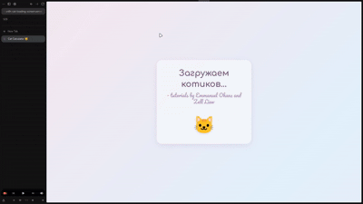

# 🐱 Catculator — калькулятор с кошачьим экраном загрузки

Веб-приложение, объединяющее два учебных проекта: **экран загрузки** в стиле Slack и **калькулятор** на чистом JavaScript. При открытии страницы пользователь видит анимированный лоадер с котиком, после чего плавно появляется калькулятор с пастельным дизайном, тёмной темой, выбором акцентного цвета и интерактивным котиком в углу экрана.

---

## 🔗 Ссылки

| | |
|---|---|
| 🚀 **Деплой** | [catculator-with-cat-loading-screen.vercel.app](https://catculator-with-cat-loading-screen.vercel.app/) |
| 💻 **Репозиторий** | [github.com/aw3ss/catculator-with-cat-loading-screen](https://github.com/aw3ss/catculator-with-cat-loading-screen) |

---

## 🎬 Демонстрация



## 🛠 Стек

- **Frontend:** HTML5, CSS3, JavaScript (Vanilla JS, ES6+)
- **Стили:** CSS-переменные, Flexbox, CSS Grid, `@keyframes`, `backdrop-filter`
- **Шрифты:** Google Fonts — [Comfortaa](https://fonts.google.com/specimen/Comfortaa), [Pacifico](https://fonts.google.com/specimen/Pacifico)
- **Хранение:** `localStorage` (тема, акцент)
- **Backend / DB:** нет (чисто клиентское приложение)
- **Деплой:** Vercel

---

## 🚀 Как запустить локально

1. Клонировать репозиторий:
   ```bash
   git clone https://github.com/aw3ss/catculator-with-cat-loading-screen.git
   cd catculator-with-cat-loading-screen
   ```

2. Открыть `index.html` в браузере — **или** запустить локальный сервер:
   ```bash
   python3 -m http.server 8000
   ```
   и перейти на [http://localhost:8000](http://localhost:8000).

---

## ✨ Функциональность

### 🐱 Экран загрузки
- Анимированный котик, который крутится и меняет мордочку (🐱 → 😺 → 😸 → 😻 → 😽 → 😼).
- Пастельный градиентный фон с плавным переливом.
- «Стеклянная» карточка с эффектом `backdrop-filter: blur`.
- Через 2 секунды лоадер плавно исчезает, появляется калькулятор.

### 🧮 Калькулятор
- Сложение, вычитание, умножение, деление.
- Десятичные числа, кнопка `AC` / `CE` (сброс всего / сброс ввода).
- Повторное нажатие `=` повторяет последнюю операцию.
- Защита от «неправильного» ввода (две точки, оператор без числа и т.д.).

### 🎨 Оформление
- Светлая и тёмная темы (сохраняются в `localStorage`).
- 5 пастельных акцентных цветов: персиковый, голубой, мятный, розовый, сиреневый.
- Адаптивная вёрстка для мобильных устройств.

### 🐾 Пасхалки
- Клик по котику в правом нижнем углу — случайная анимация (потряхивание / вращение).
- **3 клика подряд** — запускается «дождик из котиков» 🌧️🐱.

---

## 📁 Структура проекта

```
catculator-with-cat-loading-screen/
├── index.html      # разметка: лоадер + калькулятор
├── style.css       # все стили, темы, акценты, анимации
├── script.js       # логика калькулятора, темы, котик, дождик
└── README.md
```


---

## 📚 Источники / исходные туториалы

Проект собран на основе двух материалов freeCodeCamp:

1. **Build A Loading Screen** — [freecodecamp.org/news/how-to-build-a-delightful-loading-screen-in-5-minutes-847991da509f](https://www.freecodecamp.org/news/how-to-build-a-delightful-loading-screen-in-5-minutes-847991da509f)
2. **Build an HTML Calculator with JS** — [freecodecamp.org/news/how-to-build-an-html-calculator-app-from-scratch-using-javascript-4454b8714b98](https://www.freecodecamp.org/news/how-to-build-an-html-calculator-app-from-scratch-using-javascript-4454b8714b98)

Оба проекта были **объединены**, **переработаны** и **дополнены**:
- добавлена пастельная палитра и тёмная тема;
- добавлена панель выбора акцента;
- добавлен интерактивный котик и «дождик из котиков»;
- добавлены Google Fonts (Comfortaa, Pacifico);
- добавлено сохранение настроек в `localStorage`.


## 📄 Лицензия

Учебный проект. Свободно используется в образовательных целях.
